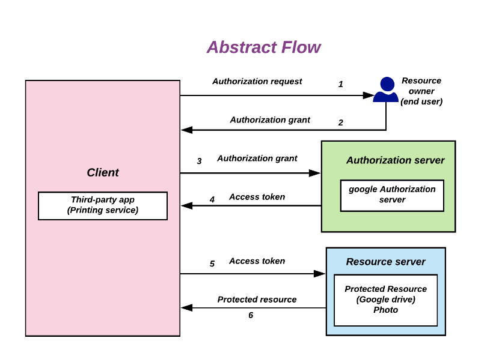
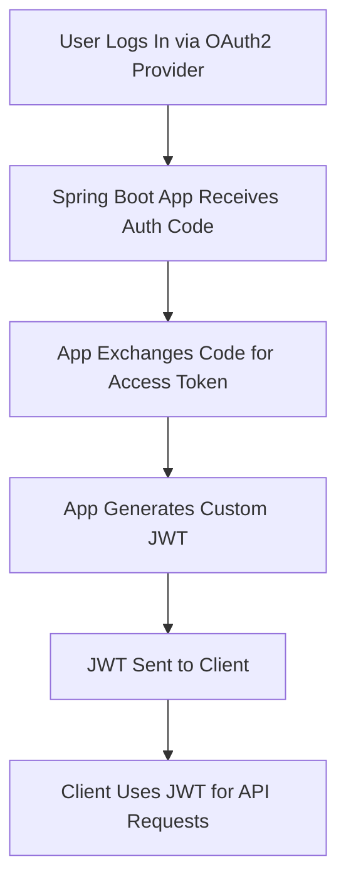

# 🔐 Java Spring Boot Authentication Security

Welcome, fellow developer! This guide is your go-to reference for securing Java Spring Boot applications with modern authentication and authorization techniques. We'll explore Spring Security fundamentals, OAuth 2.0, and stateless JWT authentication.

> 📚 Detailed guides:
>
> 👉 [JWT Guide](Spring Boot Auth Docs/jwt-guide-complete.md)  
> 👉 [OAuth 2.0 Guide](./oauth2-guide.md)

---

## 🚦 Authentication vs Authorization

| Concept        | Purpose                            |
|----------------|-------------------------------------|
| 🧍 **Authentication** | Verifies identity (e.g., login)      |
| 🔐 **Authorization**   | Grants access based on roles/rights |

Spring Security enables you to enforce both using a customizable filter chain.

---

## 🧰 Common Authentication Approaches

### 🔸 Basic Auth

```java
http
  .authorizeHttpRequests(auth -> auth.anyRequest().authenticated())
  .httpBasic();
```

✅ Quick to set up  
❌ Not secure for production unless used with HTTPS and in internal tools

---

### 🔸 Form-Based Login

```java
http
  .formLogin(Customizer.withDefaults())
  .authorizeHttpRequests(auth -> auth
    .requestMatchers("/admin/**").hasRole("ADMIN")
    .anyRequest().authenticated()
  );
```

- Customizable login pages
- Better suited for web applications

---

### 🔸 Filter Chain Mechanics


### 🧾 JWT (JSON Web Token)

JWT enables stateless API authentication.


```http
Authorization: Bearer <your_jwt_token>
```

> 📘 [Full JWT Guide](./jwt-guide.md)  

---

### 🚪 OAuth 2.0

Authenticate users via third-party providers (GitHub, Google, etc.).



```java
http
  .oauth2Login()
  .authorizeRequests(auth -> auth.anyRequest().authenticated());
```

> 📘 [Full OAuth 2.0 Guide](./oauth2-guide.md)

---

## 🚦 OAuth 2.0 vs JWT: Key Differences

| Feature        | OAuth 2.0                            |JWT (JSON Web Token)                |
|----------------|-------------------------------------|-------------------------------------|
| What it is        | Authorization framework | Token format |
| Purpose           | Allows third-party apps to access resources on behalf of a user. | Transports and stores claims securely between parties |
| Protocol vs Format | Protocol/Standard | Data format (used in OAuth2 or separately) |
| Use Case | "Hey Google, can I access this user's calendar?" | "Here’s a signed token saying who I am and what I can do." |
| Token Type | Can use multiple token types (including JWT, opaque tokens) | It is the token |
| Used for           | Delegated access to protected resources | Authentication and authorization details |
| Built-in Expiry           | Yes (via access_token and refresh_token) | Yes (via exp claim) |
| Can be Stateless?  | Not always (depends on token format) | Yes (JWT is self-contained) |

## 🔄 Spring Security Filter Chain

Spring Security uses a chain of filters that intercepts requests and applies security logic.
- SecurityContextPersistenceFilter: Restores or initializes the SecurityContext from the session or creates a new one.
- UsernamePasswordAuthenticationFilter: Handles form-based login authentication.
- CsrfFilter: Validates CSRF tokens to mitigate cross-site request forgery.
- FilterSecurityInterceptor: Authorizes requests based on roles and authorities.
  
```java
@Bean
public SecurityFilterChain filterChain(HttpSecurity http) throws Exception {
    return http
        .csrf(AbstractHttpConfigurer::disable)
        .authorizeHttpRequests(auth -> auth
            .requestMatchers("/admin/**").hasRole("ADMIN")
            .anyRequest().authenticated()
        )
        .addFilterBefore(customAuthFilter(), UsernamePasswordAuthenticationFilter.class)
        .formLogin(Customizer.withDefaults())
        .build();
}

```

The flow of request processing in Spring Security:

```text
Request -> FilterChainProxy ->
  SecurityContextPersistenceFilter ->
  UsernamePasswordAuthenticationFilter ->
  FilterSecurityInterceptor -> Controller
```

🧩 *Filters can be customized or extended.*

---

## 🧠 Architecture Comparison

| App Type       | Recommended Stack                       |
|----------------|------------------------------------------|
| Web App        | Spring Security + OAuth2                |
| REST API       | OAuth2 + JWT                            |
| Microservices  | OAuth2 Client Credentials + JWT         |

---

## 📋 Full Auth Flow (OAuth2 + JWT)



---

## ✅ Security Best Practices

| ✅ Practice                | 📌 Why It Matters                               |
|---------------------------|-------------------------------------------------|
| Use HTTPS                 | Prevents MITM & token interception              |
| Validate All JWT Claims  | Ensure token integrity and validity             |
| Rotate Secrets            | Minimize risk of credential leakage            |
| Use Refresh Tokens        | Maintain session without long-lived access     |
| Implement Token Revocation | Handle logouts & compromise scenarios          |
| Keep Token Expiration Short | Limit the window of exploitation              |

---

## 🛠️ Sample End-to-End Setup

```java
@Bean
public SecurityFilterChain filterChain(HttpSecurity http) throws Exception {
    return http
        .csrf(AbstractHttpConfigurer::disable)
        .authorizeHttpRequests(auth -> auth
            .requestMatchers("/api/admin/**").hasRole("ADMIN")
            .anyRequest().authenticated()
        )
        .oauth2Login()
        .oauth2ResourceServer(oauth2 -> oauth2.jwt())
        .build();
}
```

---

## 🧪 Testing Authenticated APIs

```bash
curl -H "Authorization: Bearer <your_token>" http://localhost:8080/api/user
```

| Case             | Result          |
|------------------|-----------------|
| No Token         | 401 Unauthorized|
| Expired Token    | 403 Forbidden   |
| Valid Token      | 200 OK          |

---

## 📚 Linked Resources
### 📘 Spring Security:
- [Spring Security Docs](https://spring.io/projects/spring-security)
- [Spring Security reference](https://docs.spring.io/spring-security/reference/)
### 🔑 OAuth2:
- [OAuth 2.0 Guide](./oauth2-guide.md)
- [OAuth Playground](https://developers.google.com/oauthplayground)
- [OAuth 2.0 datatracker](https://datatracker.ietf.org/doc/html/rfc6749)
- [spring boot OAuth 2.0](https://spring.io/guides/tutorials/spring-boot-oauth2/)
### 🪪 JWT:
- [JWT Guide](./jwt-guide.md)
- [JWT.io](https://jwt.io)
- [JWT Datatracker](https://datatracker.ietf.org/doc/html/rfc7519)
- [Designing-a-secure-jwt]( https://developer.okta.com/blog/2019/05/01/designing-a-secure-jwt)
### 🛡️ Security Guidelines:
- [OWASP Top 10](https://owasp.org/www-project-top-ten/)
- [Security best practices](https://cloud.google.com/security/best-practices/)
### 🧪 Testing Tools:
- [Reqbin](https://reqbin.com)
- [Project zap](https://owasp.org/www-project-zap/)

